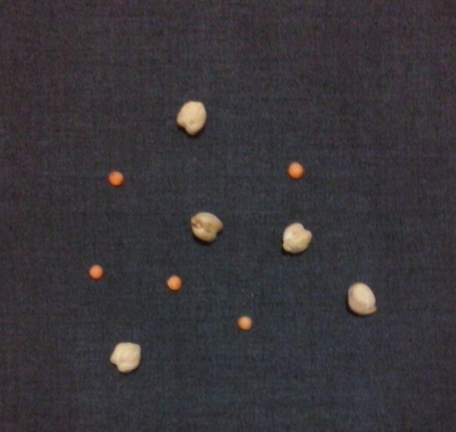
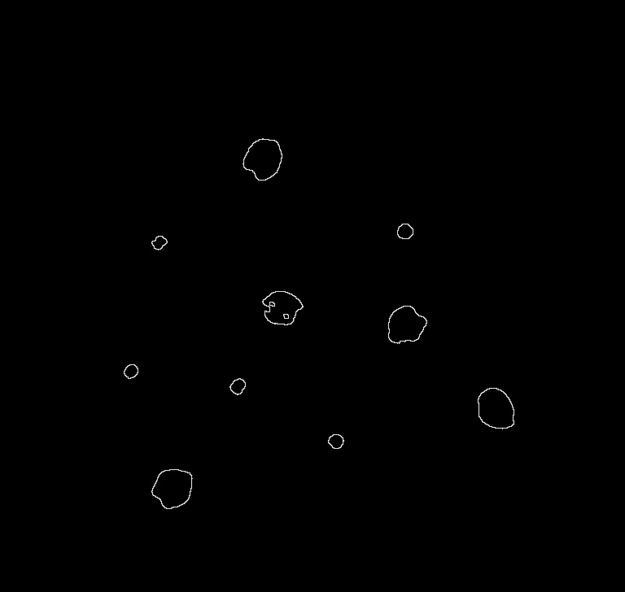
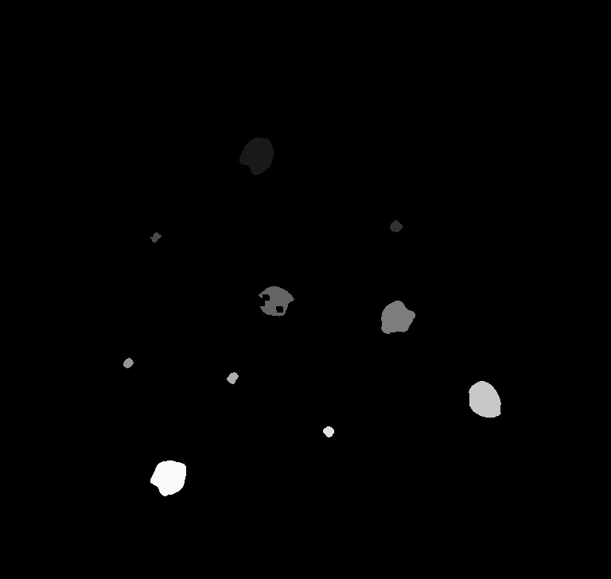

# Count Lentils
Counters chickpeas and lentils in a BMP image. Works with two classes. Tested with 768x728 image. May not work on larger images.

## Binary Representation
Program itself uses K-Means algorithm to convert intensity image to binary representation.

## Boundary Extraction
Edge detection or boundary extraction is implementing with erosion and dilation features. 

## Detecting Objects and Colorization
All objects in image are detecting with CCA which is Connected Component Analysis algorithm that searching for a neighborhood between pixels. Colorization is implementing according to tag array returned from CCA function.

