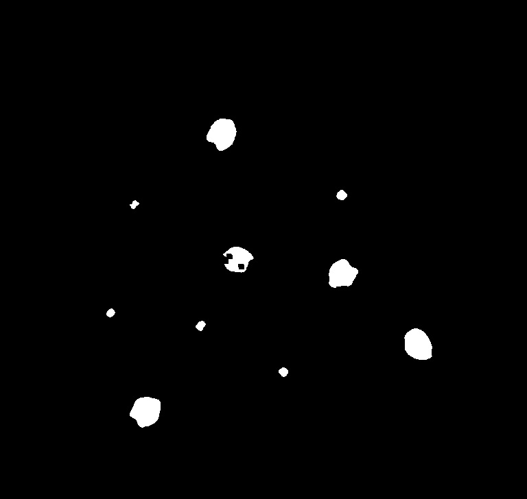

## Count Lentils
Counters chickpeas and lentils in a BMP image. Works with two classes. Tested with 768x728 image. May not work on larger images.

### Binary Representation
Program itself uses K-Means algorithm to convert intensity image to binary representation.

